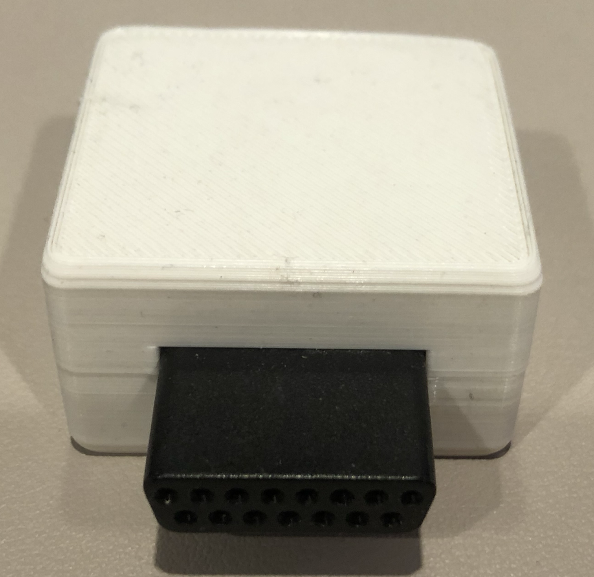
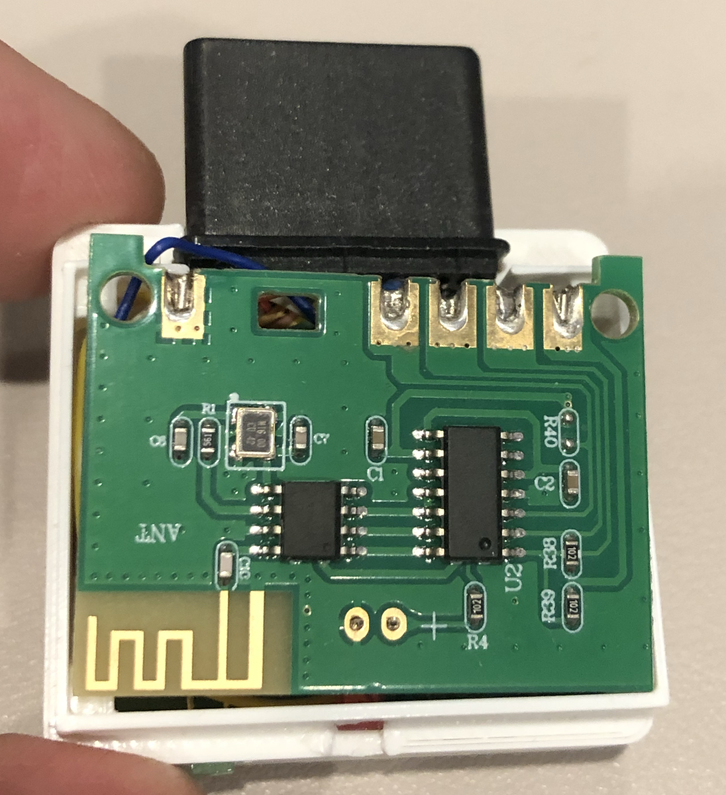
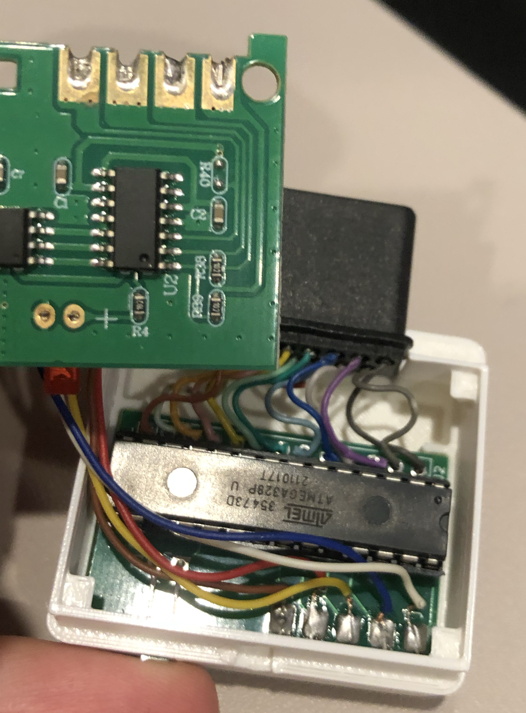
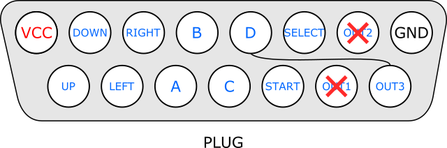
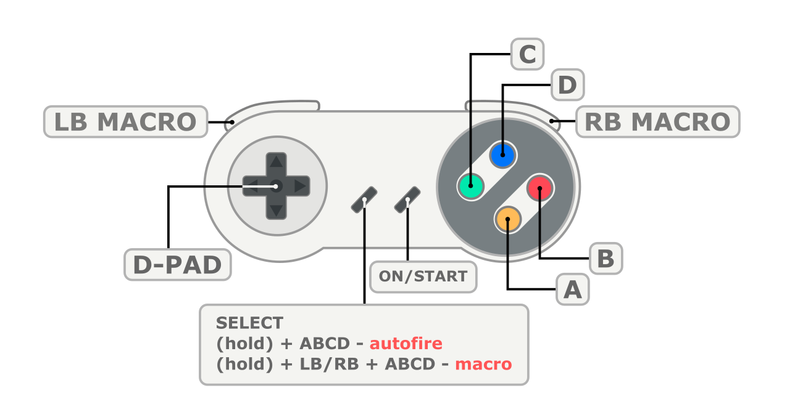

NeoGeoWireless
====

NeoGeoWireless implements a wireless Neo Geo controller on top of
a cheap aftermarket 2.4 GHz SNES Controller.  
It works by converting the SNES controller signals (that would
normally go to the SNES) to the Neo-Geo, in the process adding
features, like Turbo and Macro button support.

## Requirements

[2.4GHz SNES Controller](https://www.amazon.com/gp/product/B09H4826RV/)  
3x 0.1uF Capacitors  
LED (to display turbo status)  
Atmega328P  
Neo-Geo controller DIN connector, hopefully cannibalized from NG Controller extension cords  
Custom PCB [schematics](schematics/rx-snes/) for the receiver add-on board (KiCad, [PDF](docs/schematic.pdf))  
[3D-printed case](stl/NGRcvrSNES.stl) ([slightly roomier version](stl/NGRcvrSNESDev.stl) for prototyping)  

## Firmware

[Firmware](build/) for the Atmega328P (run `make installsnesrx`)  

## Examples

### Plug front

  

### SNES receiver board

  

### Add-on board

  

### Neo Geo Controller port pinout

  

### Button mapping


## LICENSE

```
Copyright 2021-2024, Akop Karapetyan

Licensed under the Apache License, Version 2.0 (the "License");
you may not use this file except in compliance with the License.
You may obtain a copy of the License at

    http://www.apache.org/licenses/LICENSE-2.0

Unless required by applicable law or agreed to in writing, software
distributed under the License is distributed on an "AS IS" BASIS,
WITHOUT WARRANTIES OR CONDITIONS OF ANY KIND, either express or implied.
See the License for the specific language governing permissions and
limitations under the License.
```